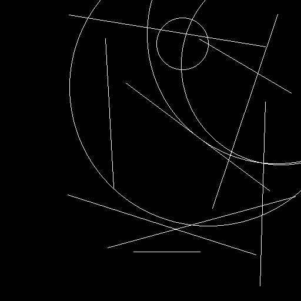
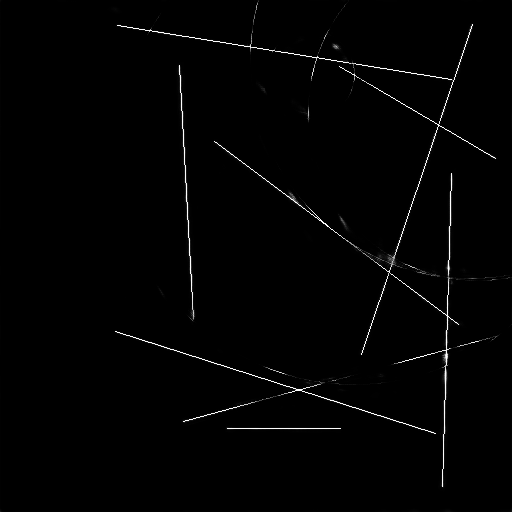

# Hough Transform using Convolutional Neural Networks (CNNs)

Given a binary edge-image, this project tries to detect lines using CNNs (Convolutional Neural Networks) by ’switching off’ active pixels that does not belong to any line.

### Motivation
Standard HT (Hough Transform) is a popularly used method of estimating lines, given a binary image. However, standard HT requires an accumulator array whose size determines the level of incorporated detail. This introduces a tradeoff between precision and computational cost. Furthermore, the level of detail to be accounted in accumulator array differs from image to image which leads to hyper-parameter optimization _for each image_.

For more details, please see the [project report](./docs/report.pdf).

### Results
 


 

In this repository, we provide
* Dataset generation code
* Training/Testing code to reproduce the results
* Pretrained (only best two) models' weights
* Results of pretrained (only best two) models 

## 1. Getting Started

These instructions will get you a copy of the project up and running on your local machine for development and testing purposes.

### 1.1. Prerequisites

You need to have following libraries installed:
```
Skimage >= 0.13.0
Sklearn >= 0.19.1
Numpy >= 1.13.1

Tensorflow >= 1.0.0
Keras >= 2.0.5 
Keras_contrib >= 0.0.2

Pydot
Graphviz
```

### 1.2. Installation

#### 1.2.1. Anaconda

Although, packages listed above can be seperately downloaded and installed, it's recommended to install Anaconda package to install all scipy libraries at once.

1. Download Anaconda Installer from [here](https://www.anaconda.com/download/)

2. Run the downloaded ```.sh``` script with bash: 
```bash Anaconda****.sh```

#### 1.2.2. Keras 
Use ```conda``` package manager to install Keras:
  * For CPU version: ```conda install keras```
  * For GPU Version: ```conda install -c anaconda keras-gpu``` 
(Note: This will automatically install ```tensorflow``` too.)

## 2. Demo/Quick Start
1. Put the images in directory ```$dir```

1. Go to ```./src/``` folder
```
cd src/
```

2. Run ```test.py``` python script. This script will predict images in ```dataDir``` and save the results in ```outDir```.
```
python test.py -dataDir <path-to-test-images> -outDir <path-to-save-results-to> -modelExpName <experiment-log-directory>
``` 
(For details on all arguments, please run ```python test.py --help```) 

**NOTE: Default arguments of ```test.py``` are set to run our best model on default data location.**

## 3. Training

### 3.1. Dataset Preparation

1. Go to ```./src/``` folder
```
cd src/
```

2. Run the ```generate_dataset.py``` script to generate the dataset synthetically. This will save input images and corresponding ground truth images at ```outDir/X/``` and ```outDir/Y/``` respectively.
```
python prepare_dataset.py -outDir <path-to-save-images> -numImgs <number-of-images-to-generate>
``` 
(See all arguments using ```python generate_dataset.py --help```)

### 3.2. Training the model

Run the ```train.py``` script to train a model on generated dataset, like so: 
```
python train.py -dataDir <path-to-dataset> -netType <network-name> -logDir <path-to-save-experiment>
``` 
(See all arguments using ```python train.py --help```)

This will train a specified model on the specified dataset and will save the following to ```logRootDir/logDir/```: 
  * Model architecture along with weights
  * Tensorboard logs
  * Predictions on validation set (of best performing model only)
  * Options used for generating this experiment

**NOTE: Default arguments of ```train.py``` are set to train sequential image-to-image network from scratch.**

## Author(s)

**Muneeb Aadil** - [Github Profile](https://github.com/muneebaadil)

Feel free to contact me in case of any queries! :) 

(Email: imuneebaadil@gmail.com)